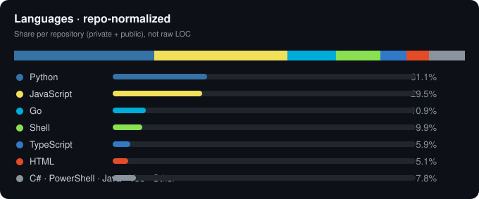

<div align="center">

# WUZZSTORE

**Backend · Automation · Messaging Bots · API Engineering**

[](https://github.com/wuzzstoreservice)
[](https://wuzzstoreservice.github.io)
[](https://wuzzstore.my.id)
[](https://go.dev)
[](https://python.org)
[](https://nodejs.org)

<br />

Backend & automation engineer focused on **messaging bots**, **REST APIs**, and **browser automation**.  
Building production tools for commerce platforms, account workflows, and developer tooling — primarily in **Go** and **Python**.

🌐 **Portfolio:** [wuzzstoreservice.github.io](https://wuzzstoreservice.github.io)

</div>

---

## Languages

> Share per repo (repo-normalized) · private + public · bukan raw LOC  
> agar dump Unity/C/Java tidak mendominasi statistik.

<div align="center">



</div>

| Language | Share |
|---|---:|
| **JavaScript** | **37.3%** |
| **Python** | **24.1%** |
| **Go** | **19.8%** |
| **TypeScript** | **8.4%** |
| **HTML** | **8.0%** |
| **Shell** | **1.7%** |
| **CSS** | **0.5%** |
| Other | 0.2% |

```text
JavaScript  ████████████████████████████████████░░░░░░░░░░░░░░░░  37.3%
Python      ████████████████████████░░░░░░░░░░░░░░░░░░░░░░░░░░  24.1%
Go          ████████████████████░░░░░░░░░░░░░░░░░░░░░░░░░░░░░░  19.8%
TypeScript  ████████░░░░░░░░░░░░░░░░░░░░░░░░░░░░░░░░░░░░░░░░░░   8.4%
HTML        ████████░░░░░░░░░░░░░░░░░░░░░░░░░░░░░░░░░░░░░░░░░░   8.0%
Shell       ██░░░░░░░░░░░░░░░░░░░░░░░░░░░░░░░░░░░░░░░░░░░░░░░░   1.7%
CSS         █░░░░░░░░░░░░░░░░░░░░░░░░░░░░░░░░░░░░░░░░░░░░░░░░░   0.5%
```

[](https://wuzzstoreservice.github.io/#languages)
[](https://wuzzstoreservice.github.io/#languages)
[](https://wuzzstoreservice.github.io/#languages)
[](https://wuzzstoreservice.github.io/#languages)
[](https://wuzzstoreservice.github.io/#languages)

---

## Featured projects

| Project | Stack | What it does |
|--------:|:-----:|--------------|
| [**telesell**](https://github.com/wuzzstoreservice/telesell) | Go · SQLite · PM2 | Telegram commerce bot base — admin gate, SQLite users/products/history, premium emoji helpers |
| [**basewa-golang**](https://github.com/wuzzstoreservice/basewa-golang) | Go · whatsmeow | WhatsApp bot foundation — QR/pairing login, media send helpers, reply-aware message service |
| [**telegram-bot**](https://github.com/wuzzstoreservice/telegram-bot) | Go · SQLite | WUZZSTORE order bot — balance, products, order flow, local history, webhook status updates |
| [**OmniCaptcha-AI-ID**](https://github.com/wuzzstoreservice/OmniCaptcha-AI-ID) | Go · Gemini VLM | Universal AI captcha solver — vision model + structured drag/click actions for automation |
| [**tempmail-pro**](https://github.com/wuzzstoreservice/tempmail-pro) | Node · React | Self-hosted temp mail — realtime inbox, REST + WebSocket, token auth, DKIM outbound |
| [**tokengo-bulk**](https://github.com/wuzzstoreservice/tokengo-bulk) | Python | Bulk account/API key tooling for OpenAI-compatible LLM gateways |

Private work also includes panel frontends (Next.js), payment integrations, Google session APIs, and automation services used in production.

---

## What I build

```text
Messaging bots     Telegram (go-telegram-bot-api) · WhatsApp (whatsmeow)
APIs & backends    REST services · SQLite/Postgres · webhook receivers
Automation         Browser flows · session management · captcha solving
Commerce tooling   Order bots · product catalogs · payment hooks
Ops                PM2 · systemd · headless Chrome · proxy pools
```

---

## Tech stack

<p align="left">
  
  
  
  
  
  
  
  
  
  
  
  
</p>

---

## Currently focused on

- Production-grade **Telegram / WhatsApp** bot foundations in Go  
- Clean service layers: config → handler → message → storage  
- Automation systems that run unattended on VPS (PM2 / systemd)  
- Developer-facing tools around APIs, sessions, and account workflows  

---

## Connect

- Portfolio: [wuzzstoreservice.github.io](https://wuzzstoreservice.github.io)  
- Platform: [wuzzstore.my.id](https://wuzzstore.my.id)  
- GitHub: [@wuzzstoreservice](https://github.com/wuzzstoreservice)  
- Email: `wuzzstoreservice@gmail.com`  

---

<div align="center">

**Ship bots. Automate flows. Keep backends simple.**

</div>
